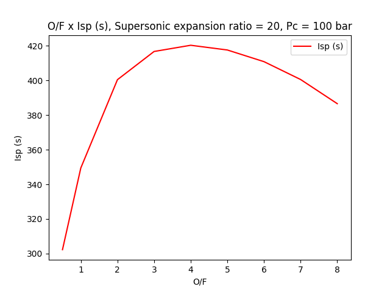

# Chemical Equilibrium With Application in Python - CEApy

**_Version:_** 1.0.5 (_Under development_), December 26, 2022  

**_Short Description:_** Python library that automates analysis of rocket problems in  
CEA-NASA, which for now only works on Windows.  

**_Author:_** Julio C. R. Machado  
Undergraduate student in the last period of the aerospace engineering course  
at Federal University of Maranhão - Brazil.

**_Emails_**: julioromac@outlok.com, machado.juliocr@gmail.com, machado.julio@discente.ufma.br
### _Install:_
    pip install CEApy
#### _Long Description:_
        The library was developed to be embedded in other libraries, allowing automatic analysis
    of the combustion process in rocket engine chambers. In its first version, it is possible to
    analyze all combinations of compounds available in the thermodynamic library of CEA, which h
    as a method called search_specie to search for all available chemical species.
        The library works by taking the parameters passed by the user through the settings, input
    _propellants, input_parameters and output_parameters methods, and creating the input .inp fil
    e, for subsequent execution of the fortran code developed by (Mcbride and Gordon, 1994.) For 
    now only available on Windows by using the CEA2.exe executable and not the cea.f code. After 
    execution, the library takes the desired parameters and exports the data in a   Pandas datafr
    ame through the get_results method.
        For now, only rocket problems are available in the library, and methods that allow analyz
    ing new specific mixtures by the number of atoms and their junction have not yet been created.
    Methods that allow inserting, omitting or selecting species are not yet available, as well as
    the option trace specie values and the parameters of Champman-Jouquet Detonation. These featu
    res will be implemented in future versions.

## &emsp;&emsp;&emsp;&emsp;&emsp;&emsp;&emsp;&emsp;&emsp;&emsp; _Methods_

### _importing:_
    from CEApy import CEA
### _Methods Available:_
    combustion = CEA("My_first_Analysis")
    combustion.search_specie()
    combustion.show_all_species()
    combustion.settings()
    combustion.input_propellants()
    combustion.input_parameters()
    combustion.output_parameters()
    combustion.show_inp_file()
    combustion.run()
    combustion.get_results()
    combustion.show_out_file()
    combustion.get_simulation_file()
    combustion.remove_analysis_file()
### _search_specie_
    def search_specie(self, words):

    - words: Specie to be searched
### _show_all_species_
    def show_all_species(self):

    - Show all species in  the thermodynamical data of CEA
### _settings_
    def settings(self, frozen='yes', freezing_point='exit', 
                 equilibrium='yes', short='yes', transport='yes'):
    
    - frozen: enable or disable freeze condition, 'yes' or 'no'
    
    - freezing_point: can be 'combustor' or 1, 'throat' or 2, 'exit' or 3,
    or it can be an integer equal to or greater than 1. For better understanding,
    see (McBride and Gordon, 1994) and (McBride and Gordon, 1996 ).
    
    - equilibrium: enable or disable equilibrium condition, 'yes' or 'no'
    
    - short: enable or disable short condition in the output file .out 'yes' or 'no'
    
    - transport: enable or disable transport properties in the CEA analysis
### _input_propellants_
    def input_propellants(self, oxid=None, fuel=None):
    
    - oxid: should be a list like: oxid=[oxid1,oxid2]
          oxid1 = [name,massfraction,temperature]
          name: name of propellant, massfraction: mas fraction of propellant (0 to 100),
          temperature: temperature of propellant in Kelvin.
    
    - example of two oxids:
          oxid1 = ['O2(L)',50,54.36], oxid2 = ['N2O4(L)',50,298.15]
          oxid = [['O2(L)',50,54.36],['N2O4(L)',50,298.15]]
            if one:
          oxid = [['N2O4(L)',50,298.15]]
    - fuel: fill in the same way as the oxidizer.
### _input_parameters_
    def input_parameters(self, combustion_temp=3800, chamber_pressure=None, acat=None, sub_aeat=None,
                         sup_aeat=None, pipe=None, of_ratio=None, chem_ratio=None,
                         phi_ratio=None, fbyw_ratio=None):
    
    - Parameters must be a list, lik: sup_aeat = [10,20,150], of = [1,2,3,5]
    if one: sup_aeat = [100], of = [3]
    - fbyw: fuel by weight ratio, for better undertanding of parameters, see
    McBride and Gordon, 1994) and (McBride and Gordon, 1996 ).
    - acat: contraction ratio from stagnation values to throat
    - sub_aeat: subsonic expansion ratio
    - sup_aeat: supersonic expansion ratio

    - example:
        CEA.input_parameters(chamber_pressure=[10],sup_aeat=[10,20],of_ratio=[1,2,3])
### _output_parameters_
    def output_parameters(self, user_outputs):
    
    - user_outputs: Must be a string 'all' to evaluate all available output parameters, 
    or a list of parameters, like: ['isp','cf','gam','mach','pipe']

    List of output parameters available: 
    output_list = [
    'p', 't', 'rho', 'h', 'u', 'g', 's', 'm', 'mw', 'cp', 'gam', 'son',  # thermo prop
    'pipe', 'mach', 'aeat', 'cf', 'ivac', 'isp',  # rocket performance
    'vis', 'cond', 'condfz', 'pran',  'pranfz',  # transport properties
    '%f', 'o/f', 'phi,eq.ratio', 'r,eq.ratio']  # fuel-oxidant mixture parameters

        For a better understanding of all parameters, see McBride and Gordon, 1994) and
    (McBride and Gordon, 1996 ).
### _show_inp_file_
    def show_inp_file(self, type_f='logical'):
    
    type_f: if 'logical': it shows the file being made by the code.
            if 'file': it shows the file written in the folder where
            the analysis is done, if it exists.
### _run_
    def run(self):

    - Runs the CEA analysis

### _get_results_
    def get_results(self, column_names='all', condition=3):
    
    - Returns the CEA simulation results, the parameters that were
    defined in the output_parameters method
    Column names: Must be a string 'all' to returns all available output parameters, 
    or a list of parameters, like: ['isp','cf','gam','mach','pipe']

    condition: Is the parameter that says which lines should be skipped.
    
        For example if condition = 3 and the results have 9 lines, the method will return 
    lines 3, 6, 9. If condition = 3 and the results have 14 lines, the method will 
    return lines 3, 6, 9 and 12. If condition = 4 and the results have 14 lines, the
    method will return lines 4, 8 and 12. This parameter is important to get only results
    that are of interest in certain analyses. for example, evaluating a range of
    o/f = [1,2,3,4], the method will return all results in the combustor (1), throat (2)
    and exit (3) section of all o/f considered. To get only the results in the output,
    for example, make:
        
        condition =3 (this is the default).
    
        Most of the time it is difficult to evaluate the results, so it is better to get
    all the available results, visualize and evaluate later. To get all results do:
        
        condition = 'all'
### _show_out_file_
    def show_out_file(self):

    Show the output file '.out' after executing the run method
### _get_simulation_file_
    def get_simulation_file(self, type_file='out'):
    
    Returns the file as a string for later saving in a specified folder.

    - type_file = 'inp': returns the .inp file
    - type_file = 'out': returns the .out file
    
### _remove_analysis_file_
    def remove_analysis_file(self, name=None):
    
    - Delete the analysis file from the folder

    - Always indicated after completing the analyzes and saving the relevant
    files in the working folder.

### observations:
    1 - To save data, To save data, such as simulation results, images, or .inp and
    .out files, the absolute path of the folder must be passed, for example:
    C:/users/user/desktop/file.csv
    not: 'file .csv'.
    Otherwise the files will be saved in the library installation folder.
    
    2 - In case of doubt or error in the results, or empty results, it is always
    good to look at the output file name of the analysis.out and see if there are
    errors, through the show_out_file method.

## EXAMPLE:
    Code:
```
    from CEApy import CEA
    import matplotlib.pyplot as plt
    # Evaluating Isp behavior as a function of propellant mixing rate
    
    # creating
    reaction = CEA()
    reaction.settings()
    
    # STUDY 1
    
    # adding propellants
    reaction.input_propellants(oxid=[['O2(L)', 100, 90.17]], fuel=[['H2(L)', 100, 20.27]])
    # adding input parameters
    exp_ratio = 20 # nozzle expansion rate
    p_c = 100 # chamber pressure, bar
    of_ratio = [0.5, 1, 2, 3, 4, 5, 6, 7, 8] # propellant mixing rate
    reaction.input_parameters(sup_aeat=[exp_ratio],
                              chamber_pressure=[p_c],
                              of_ratio=of_ratio)
    # adding output parameters
    reaction.output_parameters(user_outputs=['isp', 'cf', 'o/f'])
    
    # input file of CEA engine
    reaction.show_inp_file()
    # running analyses 
    reaction.run()
    # output file of cea engine
    reaction.show_out_file()
    
    # getting results
    df = reaction.get_results()
    print('df.head() of simulation results')
    print(df.head())
    
    # plotting o/f x isp
    df['isp'] = df['isp']/9.81
    print('simulation results')
    print(df)
    plt.plot(df['o/f'], df['isp'],label='Isp (s)',color='red')
    plt.title('O/F x Isp (s), Supersonic expansion ratio = {}, Pc = {} bar'.format(exp_ratio,p_c))
    plt.xlabel('O/F')
    plt.ylabel('Isp (s)')
    plt.legend()
    plt.savefig("study1_100bar.png",dpi=300,format="png")
    plt.show()
    plt.close()
    
    # getting output file to save if necessary
    strings = reaction.get_simulation_file('out')
    
    #*********************************************
    # RUNNING NEW STUDY
    
    reaction.input_propellants(oxid=[['O2(L)', 100, 90.17]], fuel=[['H2(L)', 100, 20.27]]) #same
    p_c2= 200 # chamber pressure, bar, modification 100 -> 200 bar
    reaction.input_parameters(sup_aeat=[exp_ratio],
                              chamber_pressure=[p_c2],
                              of_ratio=of_ratio)
    reaction.output_parameters(user_outputs=['isp', 'o/f'])
    
    # running
    reaction.run()
    
    # getting results
    df_study2 = reaction.get_results()
    df_study2['isp'] = df_study2['isp']/9.81
    print("df_study2 head")
    print(df_study2.head())
    
    # comparing
    plt.plot(df['o/f'], df['isp'],label='pressure = {}'.format(p_c))
    plt.plot(df_study2['o/f'], df_study2['isp'],label='pressure = {}'.format(p_c2))
    plt.title('O/F x Isp (s), Supersonic expansion ratio = {}'.format(exp_ratio))
    plt.xlabel('O/F')
    plt.ylabel('Isp (s)')
    plt.legend()
    plt.savefig("study2_200bar.png",dpi=300,format="png")
    plt.show()
    plt.close()
    
    #*******************************************
    # RUNNIG STUDY WITH FUEL MODIFICATION
    # configuring propellants
    liq_hydrogen = ['H2(L)', 50, 20.27] # half the total amount of propellant
    RP_1 = ['RP-1', 50, 298.15] # half the total amount of propellant
    
    # configuring analysis 
    reaction.input_propellants(oxid=[['O2(L)', 100, 90.17]], fuel=[RP_1,liq_hydrogen])
    
    reaction.input_parameters(sup_aeat=[exp_ratio],chamber_pressure=[p_c2],of_ratio=of_ratio)
    reaction.output_parameters(user_outputs=['isp', 'o/f'])
    
    # running
    reaction.run()
    
    # getting results
    df_study3 = reaction.get_results()
    df_study3['isp'] = df_study3['isp']/9.81
    
    print("df_study3 head")
    print(df_study3.head())
    
    # comparing
    plt.plot(df['o/f'], df['isp'],label='fuel = H2(L), pressure = {}'.format(p_c))
    plt.plot(df_study2['o/f'], df_study2['isp'],label='fuel = H2(L), pressure = {}'.format(p_c2))
    plt.plot(df_study3['o/f'], df_study3['isp'],label='fuel = [H2(L),RP-1], pressure = {}'.format(p_c2))
    plt.title('O/F x Isp (s), Supersonic expansion ratio = {}'.format(exp_ratio))
    plt.xlabel('O/F')
    plt.ylabel('Isp (s)')
    plt.legend()
    plt.savefig("study3_H2_RP1_200bar.png",dpi=300,format="png")
    plt.show()
    plt.close()
    
    # deleting analysis files
    reaction.remove_analysis_file()
```
    Output images:


![Study 3 - O2(L),[H2(l), RP-1], Pc = 200Bar](doc_images/study3_H2_RP1_200bar.png)